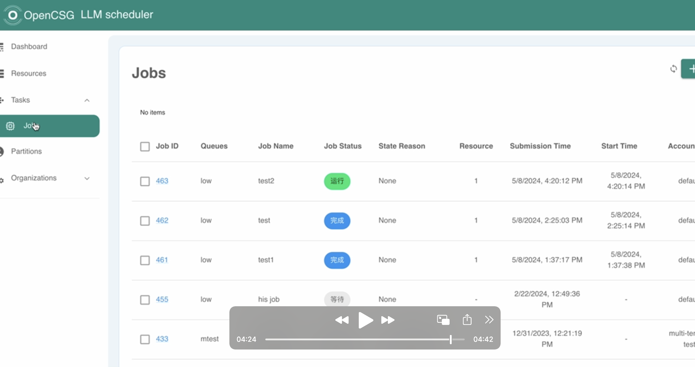

# LLM scheduler UI

## Overview

LLM scheduler UI is an open source web interface to LLM jobs. the scheduler engine is using [Slurm](https://slurm.schedmd.com/) as default engine
It performs large model jobs scheduling based on GPU resources.

[](https://www.bilibili.com/video/BV1hH4y1G73D/?vd_source=998127e911ff03443d75c8df2b3d33e8)

## Prerequisite

please setup scheduler API fisrtly [llm-scheduler-api](https://github.com/OpenCSGs/llm-scheduler-api)
then configure the environment variable in .env

## Quick Start
1. install dependency
```bash
npm install yarn -g
yarn install
```
2. install dependency
```bash
yarn start
```
